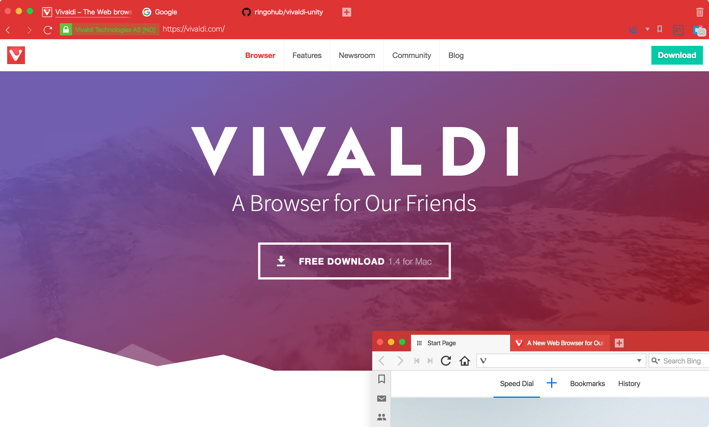
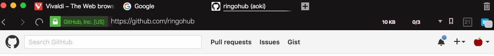

# vivaldi-unity

Vivaldi unity UI custom css.

## Unity frame-less window


## Animate icon when reload page
- Animate reload icon
- Address bar smoothly integrate into the background
- Back, forward, and reload button use only css



## How to patch?

```bash
cd /Applications/Vivaldi.app/Contents/Versions/1.4.589.38/Vivaldi Framework.framework/Resources/vivaldi
patch -p0 < /path/to/unity.patch
```
